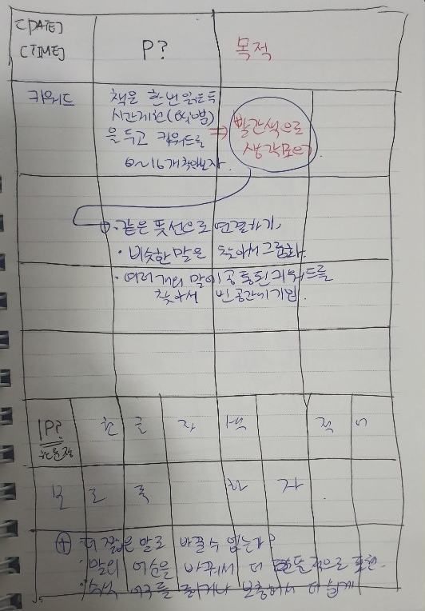

# 한 줄 정리의 힘

## 한 줄 정리의 힘

> 아사다 스구루 \(지은이\), 황혜숙\(옮긴이\)

독서메모

1. INPUT
   * 본질적인 기식 저장 \(한 장 프레임 워크 사용하기\)
2. OUTPUT
   * 다른 사람에게 설명할 수 있도록 사물 이해하기
   * 이해란, 남에게 설명할 수 있는 상태에 이른 것이다.
     * What \(개요, 결과, 현상파악\)
     * Why \(배경, 목적, 원인분석\)
     * How \(일정, 대책\)
   * 학습 : 세가지 의문사에 답하는 사고정리
3. CONTRIBUTION
   * 행동해서 만족해야 한다.
   * 행동으로 옮기겠다면 동사를 동작으로 변환하라.
     * 동작 : 행동으로 옮길 수 있는 수준의 표현
   * 자기 완결형 학습을 경계하라.
     * 나만 즐거워선 안 된다. 남에게 기여하라. 그게 진짜 학습이다.
   * 지적 호기십 학습관 / 타자 공헌형 학습















그리고 20자 공부법 프레임워크 사용연습

